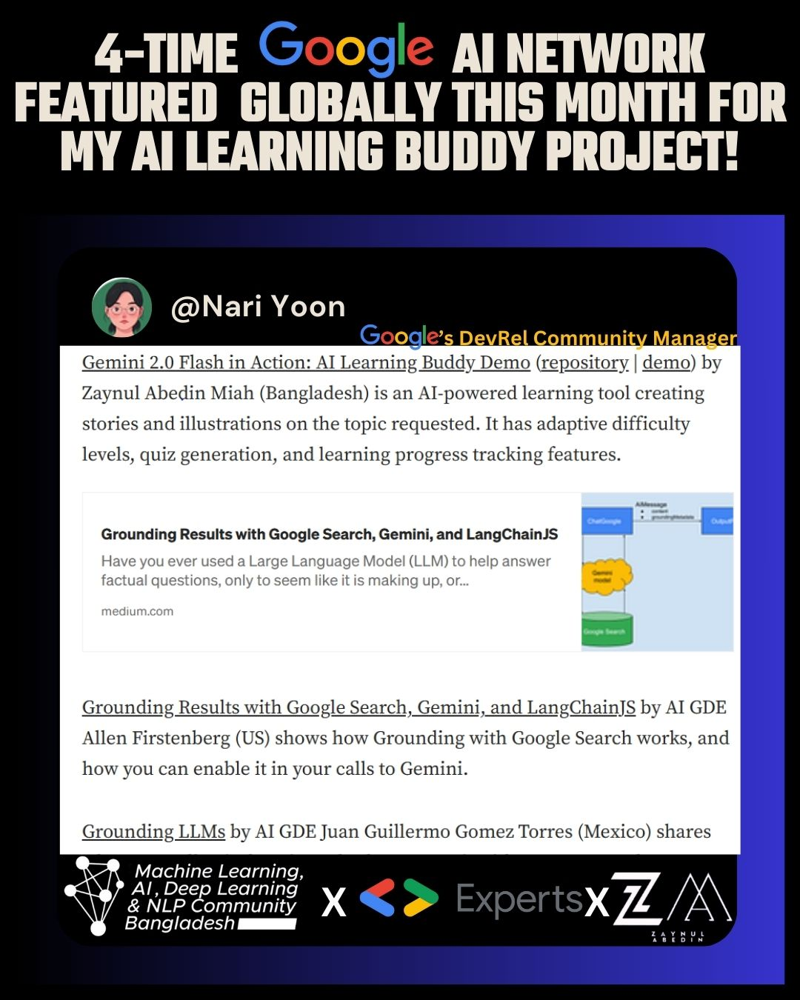

# 🤖 AI Learning Buddy 

  
  <h3>Supported By</h3>
  
  

## 🙌 Special Thanks
This project was made possible with support from Google's developer programs:
- **Google Cloud Credits** ☁️ provided by [AI/ML Developer Programs Team](https://developers.google.com/programs)
- **100 Compute Units** 💻 granted by [Colab Team](https://colab.research.google.com/)
- Technical guidance from **Vertex AI Sprint** mentors 🧠 [#VertexAISprint](https://twitter.com/hashtag/VertexAISprint)
- Vertex AI Sprint Goodies ❤ 

- ## 🌍 Community Recognition

  

**Featured in Google's Official AI Community Roundup**  
_"Gemini 2.0 Flash in Action: AI Learning Buddy Demo by Zaynul Abedin Miah (Bangladesh) is an AI-powered learning tool creating stories and illustrations on the topic requested. It has adaptive difficulty levels, quiz generation, and learning progress tracking features."_  
**- Nari Yoon**  
*Google DevRel Community Manager | Google Developer Experts Program*

📖 **Full Feature**: [January 2025 AI Community Highlights](https://medium.com/google-developer-experts/jan-2025-ai-community-activity-highlights-and-achievements-64c233e7a194)  
🏆 **4-Time Google AI Network Featured** | 🇧🇩 

  

Your smart study partner powered by **Gemini 2.0 Flash** 💡

  
  
▶️ Click image for full video demo

  

## 🚀 Features

| Feature               | Description                                                                 |
|-----------------------|-----------------------------------------------------------------------------|
| 📚 Adaptive Learning  | Get explanations at 3 difficulty levels (Beginner → Advanced)               |
| 🧩 Instant Quiz Gen   | Generate topic-specific quizzes in seconds                                   |
| 📈 Progress Tracking   | Review your learning history with expandable Q&A sections                  |
| 🎨 Clean Interface     | Minimalist UI built with Streamlit for seamless interaction                 |

## ⚡ Quick Start

1. **Get API Key** 🔑  
   [Create free Gemini API key](https://ai.google.dev)

## Features
- Interactive learning with difficulty levels
- Quiz generation
- History tracking
- Clean, minimalist interface

## Setup
1. git clone https://github.com/azaynul10/AI-Learning-Buddy.git
2. cd AI-Learning-Buddy
3. pip install -r requirements.txt
4. Set up .env with your API key
5. Run with `streamlit run app.py`
   
3. **Start Learning!** 🎓  
Ask anything from "Explain quantum physics" to "Create Python quiz"

  
  
🔍 Screenshot from Google's official community blog

## 🛠️ Tech Stack

## 📸 Demo Walkthrough

| Learning Mode | Quiz Generator | History Review |
|---------------|----------------|----------------|
|  |  |  |

**New Additions 🎉**
| Adaptive Levels | Quick Setup | Dark Mode |
|-----------------|-------------|-----------|
|  |  |  |

## 🌟 Why Use This?

- **100% Free** - No hidden costs (Gemini free tier FTW! 🤑)
- **Open Source** - Customize to your needs 🔧
- **Privacy First** - No data collection 🔒

## 🤝 Contribute

Found a bug? Have feature ideas?  
[Open an issue](https://github.com/azaynul10/AI-Learning-Buddy/issues) or [Submit PR](https://github.com/azaynul10/AI-Learning-Buddy/pulls)

---

> Made with ❤️ using [Streamlit](https://streamlit.io) + [Gemini AI](https://ai.google.dev)  
> 🎥 [Watch Full Demo](https://youtu.be/IXfyRL8AUB0?si=7jH4DXZ9MtO3BcVf) | ⭐ Star the repo if you find this useful! > Made with ❤️ using Google Cloud #VertexAISprint resources  

